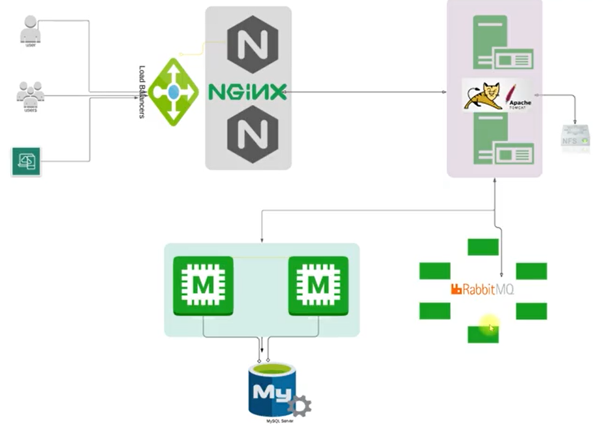

# PROYECTO Nª 1: AUTOMATIZACIÒN DE DESPLIEGUE APP MULTI-TIER CON VAGRANT
#
1. Este proyecto contiene una aplicaciòn JAVA que se desplegará bajo una arquitectura distribuida en 5 máquinas virtuales para cada servicio:
- 

